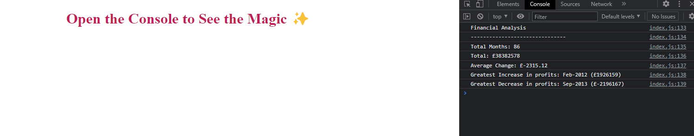

# Console-Finances - Bootcamp Week 4

## JavaScript Fundamentals: Console Finances

This project uses JavaScript to analyse a dataset composed of arrays with two fields: Date and Profit/Losses.

The JavaScript code analyzes the records to calculate each of the following:

- The total number of months included in the dataset.

- The net total amount of Profit/Losses over the entire period.

- The average of the changes in Profit/Losses over the entire period.

- The greatest increase in profits (date and amount) over the entire period.

- The greatest decrease in losses (date and amount) over the entire period.

The code uses arrays, for loops and if statements to process the data and provide the outputs, concatenated with strings so that the console displays the information in a nice readable format.

## Usage

Here is a mock up of the page:

## Credits

[Assignment] https://courses.bootcampspot.com/courses/3021/assignments/44741?module_item_id=832235

## Link to deployed application

https://sonia-deni.github.io/Console-Finances/

## License

This project is licensed under the MIT License

## Badges

